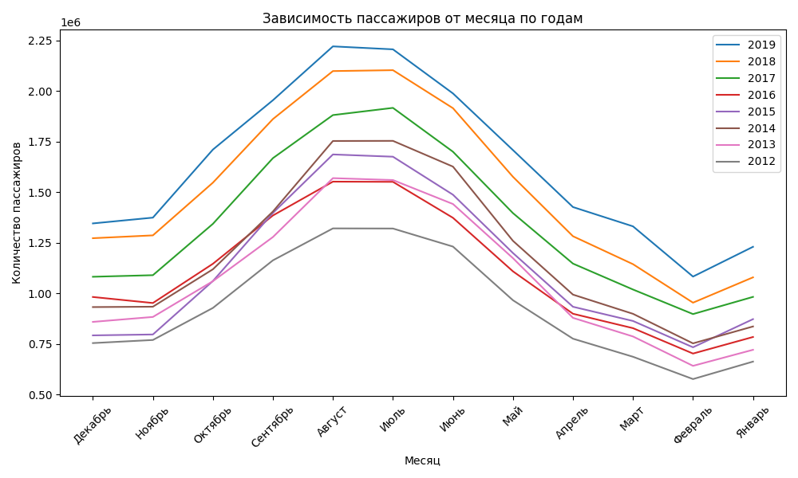
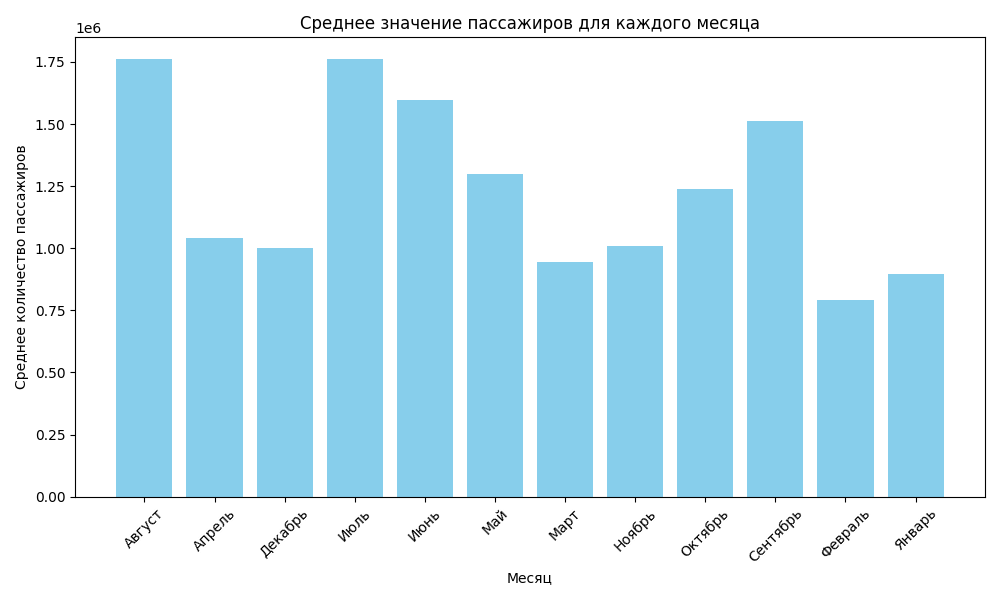
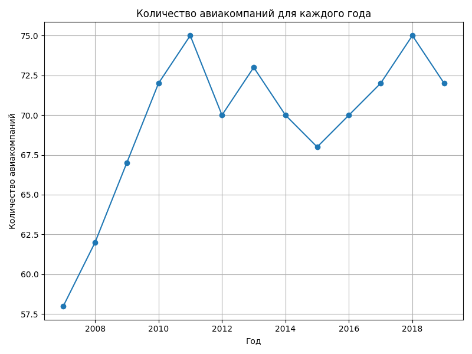

## Сбор данных о работе аэропорта Пулкова с сайта [аэропорта](https://pulkovoairport.ru)

### Воспроизведение 
- установите проект
- создайте вирутальное окружение
- установите библиотеки `pip install -r requirements.txt`
- в файле main.py выбирите формат xlsx или csv
- запустите csv

### Результат работы 
- График зависимости пассажиров от месяца по годам
  
- График среднего значения пассажиров для каждого месяца
  
- График количества авиакомпаний для каждого года
  

### Описание структуры
- csv_data - хранит данные в формате csv
- xlsx_data - хранит данные в формате xlsx
- doc_workers - классы для работы с файлами
- grafic_imgs - хранит изображения графиков
- main.py - точка входа
